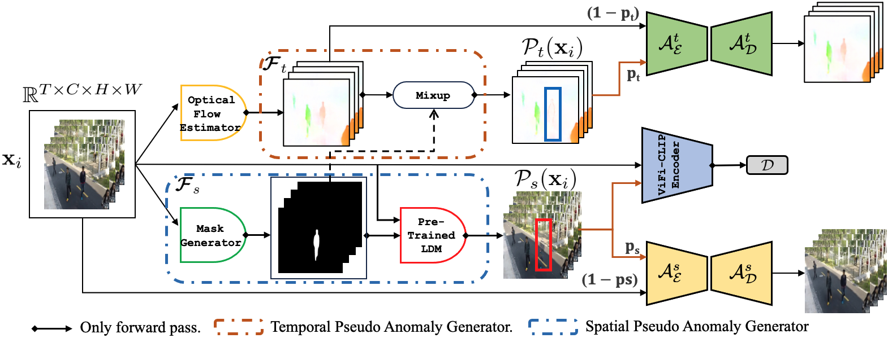
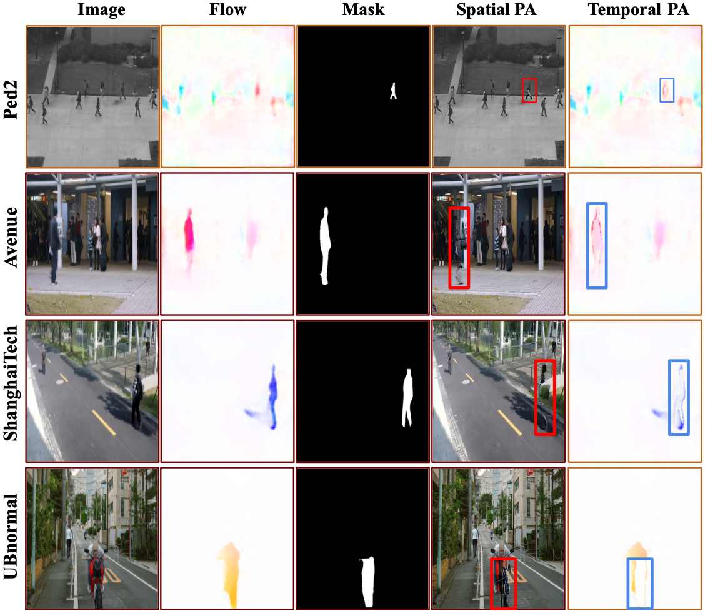
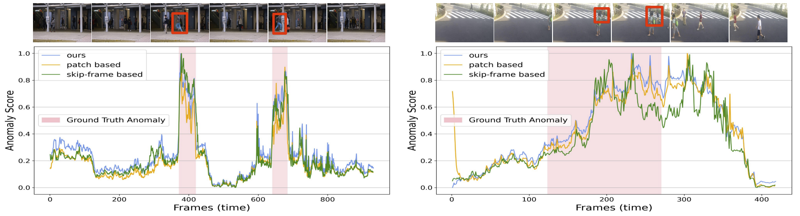

# Video Anomaly Detection via Spatio-Temporal Pseudo-Anomaly Generation : A Unified Approach (CVPRW 2024)
The Code for "Video Anomaly Detection via Spatio-Temporal Pseudo-Anomaly Generation : A Unified Approach" will be uploaded here.  
Paper Link : [https://arxiv.org/abs/2311.16514](https://arxiv.org/abs/2311.16514)

#### Main Architecture
 

#### Spatio-temporal Pseudo Anomalies

#### Anomaly Score Over Time
 

#### Please cite our paper 
